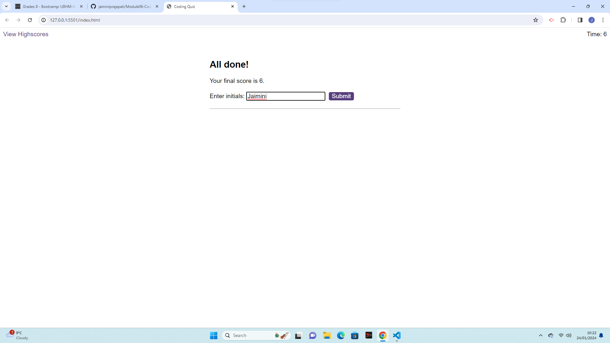
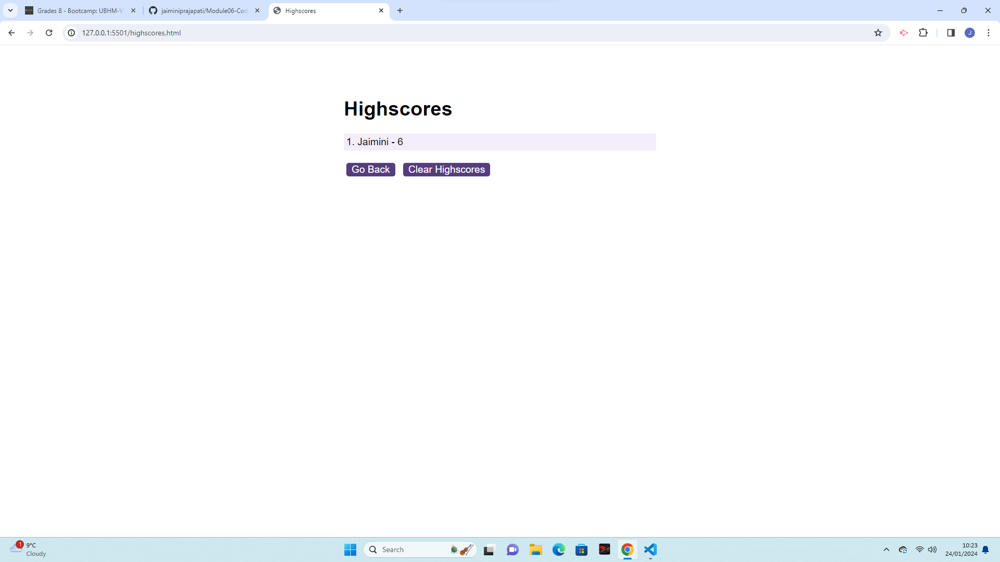

# Module06-CodeQuiz Application Readme
**Note:** The HTML files were provided by the Instructor/TA. Further changes were made to add the script files for the functionality and working of the application.

## Overview

Welcome to the Code Quiz, an engaging and interactive application designed to test and enhance your coding knowledge. This feature-rich quiz includes a dynamic timer, carefully crafted multiple-choice questions, and an intuitive user interface for an immersive experience.

## Link to the deployed application
(https://jaiminiprajapati.github.io/Module06-CodeQuiz/)

## 📸 Screenshort





## Features

### 🚀 Start Button
- Begin your coding adventure by clicking the dynamic start button.
- Initiates the quiz, kicking off the timer and revealing the first thought-provoking question.

### ⏱ Timer
- Experience the thrill of the countdown as the timer adds an element of urgency.
- The quiz ends if you successfully tackle all the questions or if time runs out.

### ❓ Multiple-Choice Questions
- Each question challenges your coding expertise with a set of carefully curated answers presented as stylish buttons.

### ✅ Answer Validation
- Receive instant feedback on your choice.
- If correct, seamlessly transition to the next exciting question.
- If incorrect, witness time deduction while remaining fully engaged.

### 🏁 Quiz Conclusion
- The quiz concludes when all questions are conquered or when time expires.

## Usage

1. **Get Started:**
   - Clone the repository to your local machine.
     ```bash
     git clone https://github.com/your-username/code-quiz.git
     cd code-quiz
     ```

2. **Launch the Quiz:**
   - Open the `index.html` file in your preferred web browser and embark on your coding journey.

## Implementation

The Code Quiz is skillfully crafted using a blend of HTML, CSS, and JavaScript. Dive into the `script.js` files to explore the seamless integration of quiz functionality, question rendering, timer management, and scoring logic.

## License

This Code Quiz application is licensed under the [MIT License](LICENSE.md).